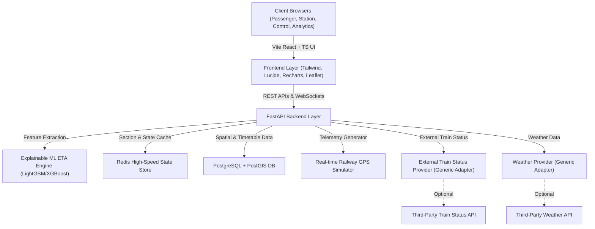

# RailDrishti AI Architecture Overview

## System Architecture



## Data Flow

```
External Train API (Optional)
        ↓
Generic HTTP Adapter → Normalizer → Redis Cache + PostgreSQL
        ↓
Data Source Manager (SIMULATOR / LIVE_API / HYBRID / PRODUCTION)
        ↓
Kinematic Simulator (Default) → Train State Store (In-Memory / Redis / PostgreSQL)
        ↓
ETA Engine → Explanation Engine → Congestion Engine → Propagation Engine
        ↓
WebSocket Broadcast (5s) + REST APIs
        ↓
Frontend Dashboards (Passenger / Station / Control / Analytics)
```

## Key Modules

1. **Dynamic ETA Prediction:** Scikit-learn + LightGBM models with section congestion and speed restriction penalties.
2. **Explainability Engine:** Identifies *why* a train is delayed (e.g., speed deficit, sectional bottleneck, weather).
3. **Multi-Persona Interface:**
   - **Passenger Portal:** Clear dynamic ETAs, delay confidence, platform updates.
   - **Control Center:** High-level section map, block section occupancy, congestion heatmaps.
   - **Station Master:** Platform dispatch, arrival sequences, turnaround management.
   - **Operations Analytics:** Delay root cause analysis, corridor performance metrics.
4. **Data Source Manager:** Switches between SIMULATOR, LIVE_API, HYBRID, PRODUCTION_AUTHORIZED modes.
5. **External Feed Adapter:** Provider-agnostic HTTP adapter for third-party train status APIs.
6. **Weather Provider:** Generic HTTP adapter for weather data (disabled by default).
7. **Persistence Service:** Persists simulator data to PostgreSQL at controlled intervals.
7. **Redis Live Cache:** Optional caching layer with automatic degradation.

## Data Source Modes

| Mode | Description |
|------|-------------|
| `SIMULATOR` | Kinematic simulator only (default for SIH demo) |
| `LIVE_API` | External third-party API only |
| `HYBRID` | API data when available, simulator for demo trains |
| `PRODUCTION_AUTHORIZED` | Placeholder for authorized Railway feeds |

## Database Schema

10 core tables + 3 new tables for external integration:
- stations, trains, rail_sections, train_schedule
- live_train_state, operational_events, eta_predictions, alerts
- historical_section_runs, weather_events
- **external_feed_raw_events** (new)
- **model_metrics** (new)
- **model_versions** (new)

## Redis Cache Keys

| Pattern | TTL | Description |
|---------|-----|-------------|
| `train:{id}:live_state` | 120s | Train live state |
| `train:{id}:eta` | 60s | Train ETA data |
| `section:{id}:congestion` | 60s | Section congestion |
| `alerts:live` | 120s | Live alerts |

## External Feed Adapter

Provider-agnostic HTTP adapter with:
- Configurable base URL, endpoint template, auth headers
- Exponential backoff retries
- Response normalization (must be customized per provider)
- Payload hashing for deduplication
- Raw payload sanitization before storage
- API key never logged or stored

## Data Source Modes

| Mode | Source |
|------|--------|
| `SIMULATOR` | Kinematic simulator (default) |
| `LIVE_API` | External third-party API only |
| `HYBRID` | API + simulator fallback |
| `PRODUCTION_AUTHORIZED` | Placeholder for authorized feeds |