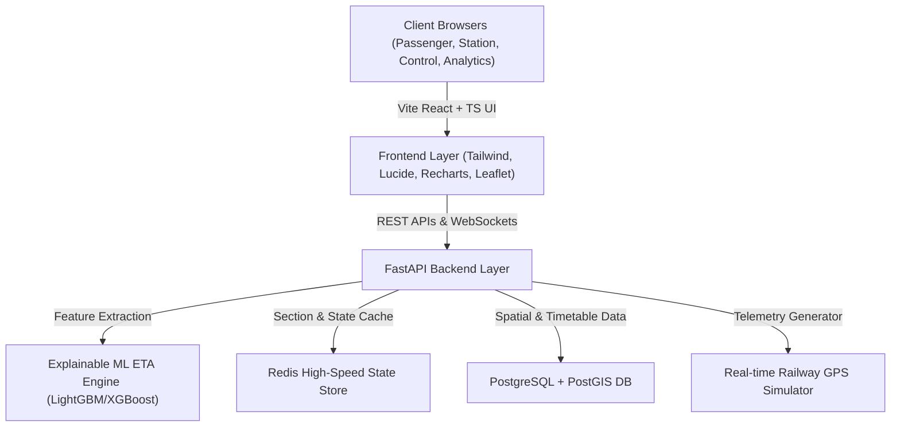

# RailDrishti AI Architecture Overview

## System Architecture

## Key Modules
1. **Dynamic ETA Prediction:** Scikit-learn + LightGBM models with section congestion and speed restriction penalties.
2. **Explainability Engine:** Identifies *why* a train is delayed (e.g., speed deficit, sectional bottleneck, weather).
3. **Multi-Persona Interface:**
   - **Passenger Portal:** Clear dynamic ETAs, delay confidence, platform updates.
   - **Control Center:** High-level section map, block section occupancy, congestion heatmaps.
   - **Station Master:** Platform dispatch, arrival sequences, turnaround management.
   - **Operations Analytics:** Delay root cause analysis, corridor performance metrics.
